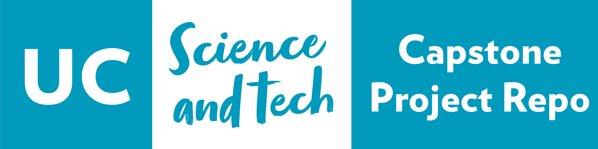

# Project Title: Software Architecture Teaching: A Systematic Review
## Group ID: 025-S1-38-11522TeamA
## Sponsor: Dr Richa Awasthy
## Mentor: Monika Gahalawat 

Template repository for UC ITS capstone projects source code. For more information see the [getting started](./docs/getting-started-with-source-control.md).

## Instructions

1. ***Instructors or Staff*** - Create a new repo using this [Template Repo](https://github.com/new?template_name=its-capstone-repo-template&template_owner=UC-SciTech)
1. Choose a **meaningful** name for the repository
1. Update the `cs-project.yaml` with your project information
1. Update the `AUTHORS` file with your team members
1. Update the `README.md` file with your project information
1. read the `CONTRIBUTING.md` and `CODE_OF_CONDUCT.md` files
1. Update the `docs/readme.md` file with your project documentation
1. Update the `NOTICE` file with any third party source
1. Remove these instructions from the `README.md` file

## Project Information

This project is a research project that requires systematic literature review of software architecture teaching including search, data analysis, and publication of results. The output of this project is a paper with insights gained through review to be published in an academic venue.

## Documentation

Use the [`./docs`](./docs/readme.md) folder to store project documentation using [Markdown](https://docs.github.com/en/get-started/writing-on-github/getting-started-with-writing-and-formatting-on-github).

## Helpful Links

Getting started with coding and using Github.

| Name | Link |
| ---- | ---- |
| Github getting started | [Github.com](https://docs.github.com/en/get-started/using-git) |
| Markdown cheatsheet | [Markdownguide.org](https://www.markdownguide.org/cheat-sheet) |
| What is Source Control | [Atlassian.com](https://www.atlassian.com/git/tutorials/what-is-version-control) |
| Recommended Development Tools | [Visual Studio Code](https://code.visualstudio.com/) |
